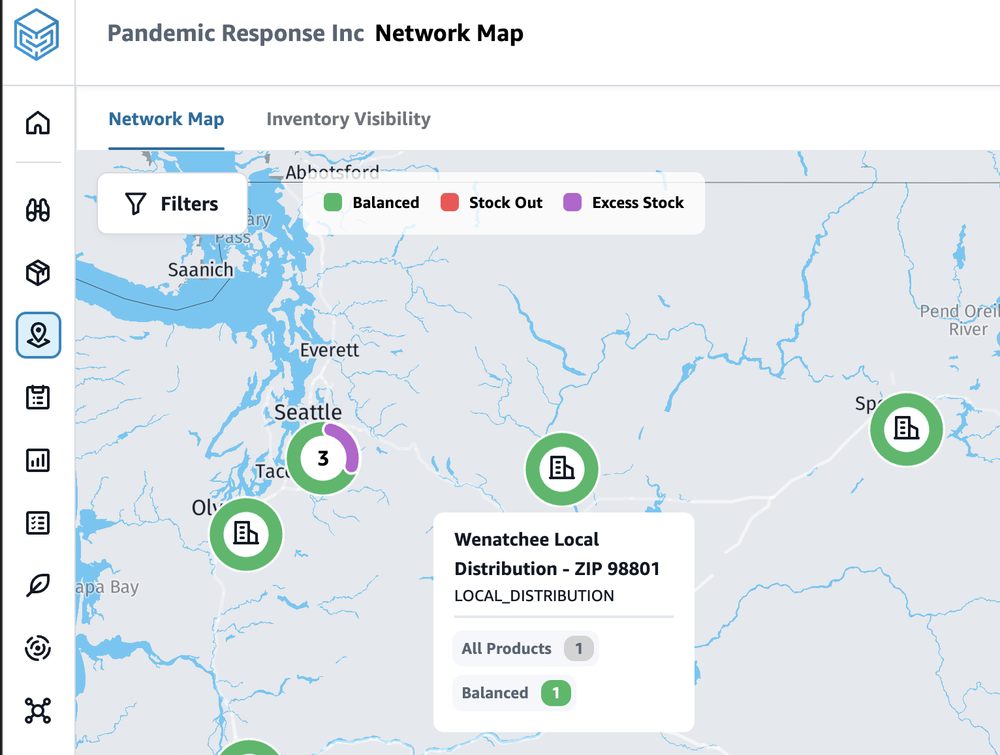

# AWS Supply Chain - Antiviral Distribution Optimization project

Demonstration of pandemic-time antiviral distribution supply chain using AWS Supply Chain service
- builds (a simulated) data of antiviral supply
- analyzes stocks of antivirals across zip codes

Inspired by 
Singh B, Huang HC, Morton DP, Johnson GP, Gutfraind A, Galvani AP, Clements B, Meyers LA. Optimizing distribution of pandemic influenza antiviral drugs. Emerg Infect Dis. 2015 Feb;21(2):251-8. doi: 10.3201/eid2102.141024. PMID: 25625858; PMCID: PMC4313645.
https://pmc.ncbi.nlm.nih.gov/articles/PMC4313645/



## Quick Start

```bash
# 0. Install dependencies with uv
uv sync

# 1. Deploy instance
uv run asc_1_deploy_helper.py

# 2. Generate and upload data (creates flows, uploads to S3, auto-triggers ingestion)
uv run asc_2_lake_builder.py --all

# 3. Check flow status and data lake
uv run asc_3_diagnostics.py --all

# 4. (Optional) Send data via API
uv run asc_4_send_events.py --all

# 5. Run coverage analysis
cd analysis-coverage
uv run coverage_1_gazeteer_zips.py
uv run coverage_2_download_acs.py
uv run coverage_3_current_stocks.py
uv run coverage_4_compute_access.py
```

## Prerequisites

- Python 3.12+
- [uv](https://docs.astral.sh/uv/) - Fast Python package installer
- AWS credentials configured (via `aws configure` or environment variables)
- AWS Supply Chain instance (created via step 1 above)

## Core Scripts

- `asc_generate.py` - Generate 15 CDM-compliant datasets (369 records)
- `asc_1_deploy_helper.py` - Instance deployment automation
- `asc_2_lake_builder.py` - Upload to S3 and manage Data Integration Flows
- `asc_3_diagnostics.py` - Diagnostics and monitoring
- `asc_4_send_events.py` - Alternative API-based ingestion (10/15 datasets)
- `validate_datasets.py` - CDM compliance validator

## Coverage Analysis

- `analysis-coverage/` - Antiviral coverage analysis pipeline
  - Analyzes geographic accessibility of antiviral stockpiles
  - Computes population-weighted distance metrics
  - Identifies coverage gaps and understocked sites
  - Integrates with AWS Supply Chain Data Lake
  - See `analysis-coverage/ABOUT_COVERAGE.md` for details

## Project Structure

```
antivirals_supply_chain/
├── asc_*.py                    # AWS Supply Chain scripts
├── validate_datasets.py         # CDM compliance validator
├── analysis-coverage/           # Coverage analysis subproject
│   ├── coverage_*.py           # Analysis pipeline scripts
│   ├── ABOUT_COVERAGE.md       # Methodology and findings
│   └── coverage-output/        # Analysis outputs (CSV, PNG)
├── output-data/                # Generated CDM datasets
├── helpers/                    # Helper scripts and reports
├── asc_instance_config.json    # Configuration
├── pyproject.toml              # Project dependencies
└── README.md                   # This file
```

## Scenario (in simulated data)

- New variant causes 300% spike in antiviral demand
- Manufacturers face 14-day lead times
- Local clinics need drugs within 24 hours
- Goal: Evaluate and optimize distribution to maximize population access

## Supply Chain Network

3-tier distribution:
- 1 Regional Hub (Seattle): 2,800 units
- 2 Distribution Centers (Spokane, Tacoma): 1,050 units each
- 4 Local Sites: 240-700 units each

## Development

### Running Individual Scripts

All scripts can be run with `uv run`:

```bash
# Generate data only
uv run asc_generate.py

# Validate datasets
uv run validate_datasets.py

# Run specific coverage analysis steps
uv run analysis-coverage/coverage_1_gazeteer_zips.py
```

### Installing uv

If you don't have `uv` installed:

```bash
# macOS/Linux
curl -LsSf https://astral.sh/uv/install.sh | sh

# Windows
powershell -c "irm https://astral.sh/uv/install.ps1 | iex"

# Or with pip
pip install uv
```

### Dependencies

All dependencies are managed in `pyproject.toml`:
- `boto3` - AWS SDK
- `pandas` - Data processing
- `requests` - HTTP requests
- `matplotlib` - Visualizations
- `seaborn` - Statistical visualizations

Run `uv sync` to install all dependencies.

